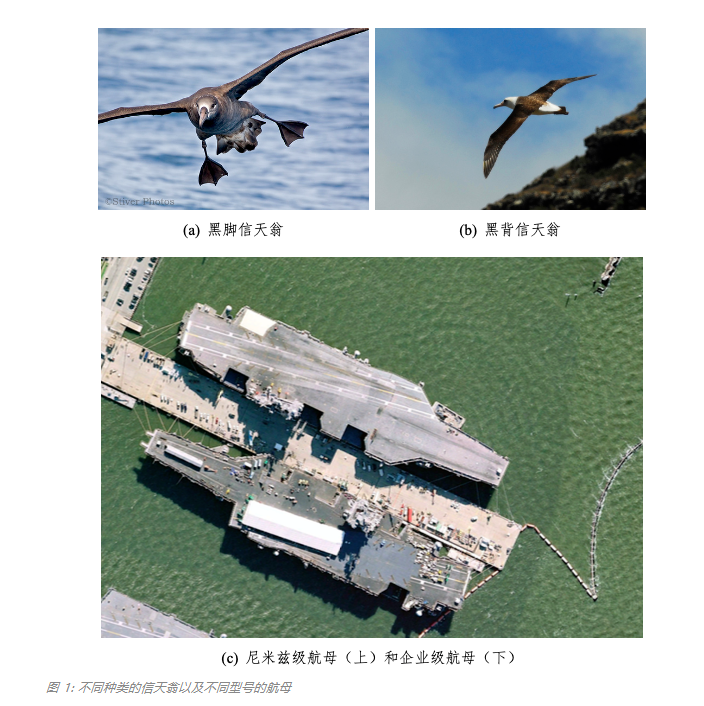
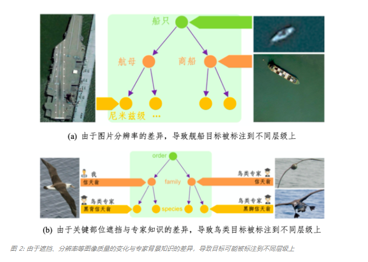
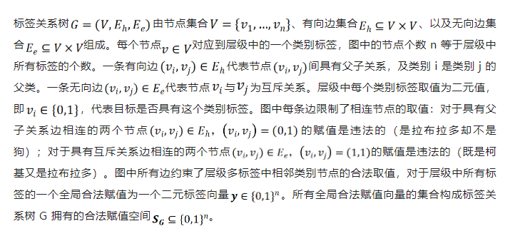
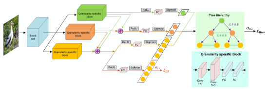
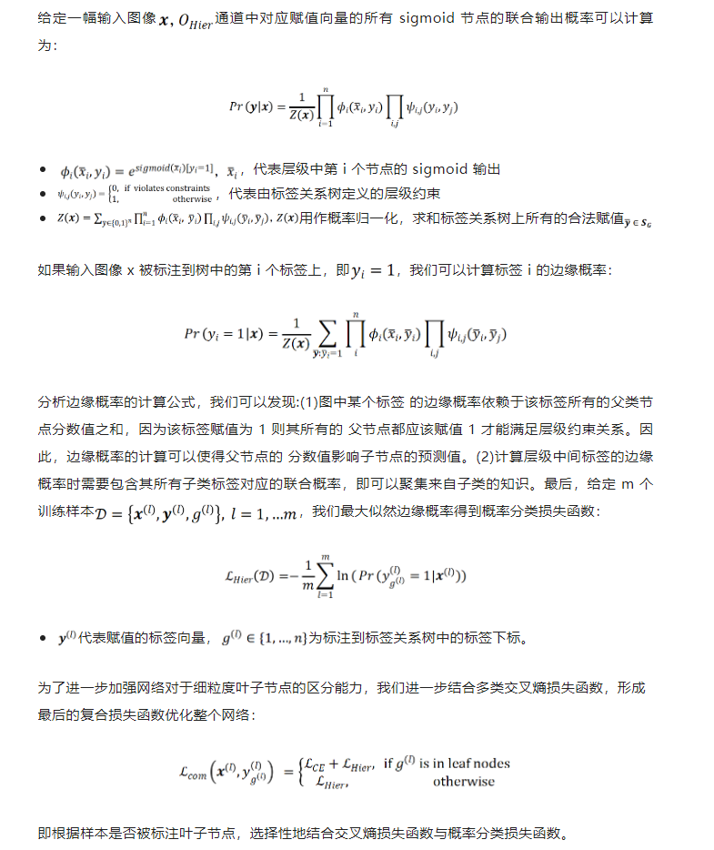
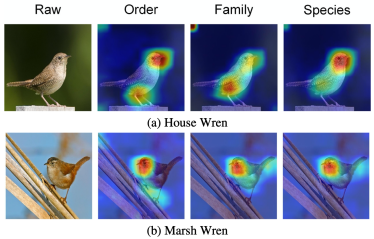
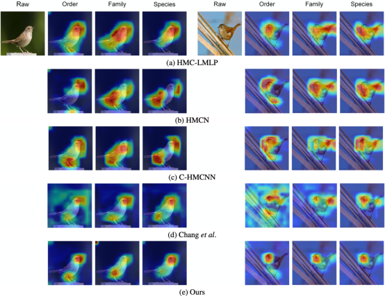

# [CVPR2022] Label Relation Graphs Enhanced Hierarchical Residual Network for Hierarchical Multi-Granularity Classification

论文地址：https://openaccess.thecvf.com/content/CVPR2022/papers/Chen_Label_Relation_Graphs_Enhanced_Hierarchical_Residual_Network_for_Hierarchical_Multi-Granularity_CVPR_2022_paper.pdf

代码地址：https://github.com/MonsterZhZh/HRN

## 本文动机
基于有监督式深度学习的图像识别任务中一个方面要求是构建整理大规模、高质量的标注数据，这就对图像质量和标注人员的背景知识有比较高的要求。例如，在细粒度分类任务中，标注人员需要依赖大量的领域知识去区分各种种类的鸟以及不同型号的舰船，如图 1 所示。
  

在图 1 中，标注人员需要借助鸟类专家的知识才能辨认黑脚信天翁与黑背信天翁，拥有一般鸟类知识的人员或许会将这两种鸟类归类为信天翁，而缺乏鸟类知识的人员可能只会将这两种鸟类归类为鸟。类似地，标注人员需要借助军事舰船专家的知识才能有效区分尼米兹级航母与企业级航母，而缺乏相关背景知识的人员可能会将这两类舰船归类为航母。也就是说，同一张图片会被拥有不同背景知识的标注人员标注到不同层级粒度的类别上。

除了背景知识对标注产生的影响，诸如鸟类辨别中的关键区域被遮挡、图像分辨率较低、或者图像比较模糊等图像质量因素也会干扰标注人员对于图像目标属于层级多粒度标签中的哪一类的判断，如图 2 所示。

  
但是，传统的图像识别数据集类别设定中，针对某个特定任务例如通用图像分类任务或者细粒度分类任务，类别标签往往只位于同一层级中，无法鲁棒地利用标注到不同层级上的图片，对标注的要求较高。为了降低图像质量以及背景知识等带来的对标注数据的高要求、充分利用具有不同层级粒度标签的样本，设计建模目标层级语义结构的层级多粒度识别算法对于提升深度神经网络的鲁棒性具有十分重要的作用。
## 方法
我们从三点观察出发构建我们的层级多粒度分类算法：

（1）由于细粒度类别可以根据不同层次的抽象向上不停迭代归类形成树形类别结构，我们构建对应的标签关系树建模层级类别间的语义关系；

（2） 有不同层级粒度标注的样本在学习时可以传递层级间的知识；

（3）现实世界中位于低层级的子类除了拥有自己的独特属性还会进一步继承来自父类的属性，我们首先为每个层级设置专有的特征提取层，根据主干网络输出的特征提取各个层级相关的特征。然后我们参考深度残差网络中经典的残差连接 设计，实现为所有父类层级的特征以残差连接的方式融合到子类层级专有的特征中，进而用于当前层级类别分类的层级残差网络(HRN)。 

**标签关系树：  **
  

  

基于残差跨层级连接的层级残差网络 (HRN) 由一个主干特征提取网络、层级特征 交互模块、以及两个并行的输出通道构成，如图 3 所示。任何常用的网络都可以作为主干网络用来提取输入图像的特征，我们选用广泛使用的深度残差网络 ResNet-50 作为 HRN 网络的主干网络。层级特征交互模块包括每个层级专有的特征提取层与残差连接部分。层级专有特征提取层网络结构一致，都包含两层卷积层后接两层全连接层 (FC)。层级专有特征提取层根据主干网络产生的共享输入特征提取每个层级专有的特征。残差连接部分首先线性组合来自粗粒度父类层级的特征与细粒度子类层级的特征，反映子类不仅具有属于自己的独特属性还继承了来自父类的属性。父类层级专有特征提取层可以视为残差连接将属于自己层级的特征逐层向下结合到子类层级的特征中。

然后，我们对组合后的特征应用非线形变换(ReLU) 后送入后续网络层。网络最后依然设置两路并行的输出通道。第一路输出通道用来基于标签关系树计算概率分类损失函数，通道中的 sigmoid 节点一一对应层级中的每个类别标签，所有 sigmoid 节点按照标签关系树进行组织。第二路输出通道中的 softmax 节点对应最后一层级中彼此互斥的细粒度类别，形成多类交叉熵损失函数让网络在优化时关注细粒度分类的误差。

**损失函数：  **

  

## 实验结果

利用 Grad-Cam 可视化算法展示各个层级响应的二维激活热力图：

  

类似地，利用 Grad-Cam 算法展示各个对比方法在不同层级上的二维激活热力图:

  

